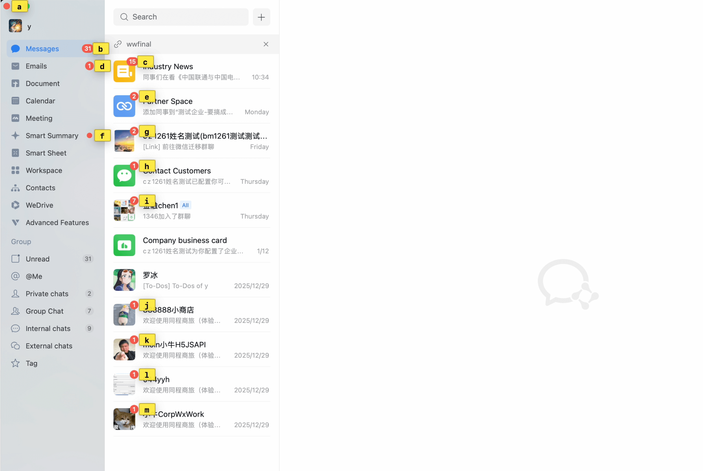

# Reddot

A macOS menubar utility that monitors Dock badge changes and automatically brings the corresponding app to the foreground. It also provides a vimium-like label navigation mode (triggered by `Control+F`) to quickly jump to badged apps.

## Features

- **Badge Monitoring** - Detects Dock icon badge changes via Accessibility API
- **Auto-Switch** - Automatically activates the app when a new badge appears
- **Vimium-like Navigation** - Press `Control+F` to enter label mode and jump to any badged app

### Vimium-like Navigation

Press `Control+F` to enter label mode. Each detected badge is assigned a stable letter label. Press the corresponding letter to click the badge, or `Esc` to cancel.



### Throttle

Same app badge changes are throttled with a **10-second cooldown** -- the first change triggers immediately, subsequent changes within 10s are ignored. This prevents rapid-fire notifications from repeatedly stealing focus.

### Input-aware Activation

Reddot will **not** switch apps while you are typing. It monitors keyboard activity (keyDown and flagsChanged events) and detects IME composing state (marked text). If the user is actively typing or has typed within the last **3 seconds**, app activation is deferred and retried every 0.5s until the user is idle.

## Requirements

- macOS 13.0+
- **Accessibility** permission (required)
- **Screen Recording** permission (required for Vimium-like navigation)

## Install

Download `Reddot.zip` from [Releases](../../releases/latest), unzip and drag `Reddot.app` to Applications.

If macOS shows *"Reddot is damaged and can't be opened"*, run:

```bash
xattr -cr /Applications/Reddot.app
```

## Build from Source

Open `Reddot/Reddot.xcodeproj` in Xcode and build.

## License

MIT
